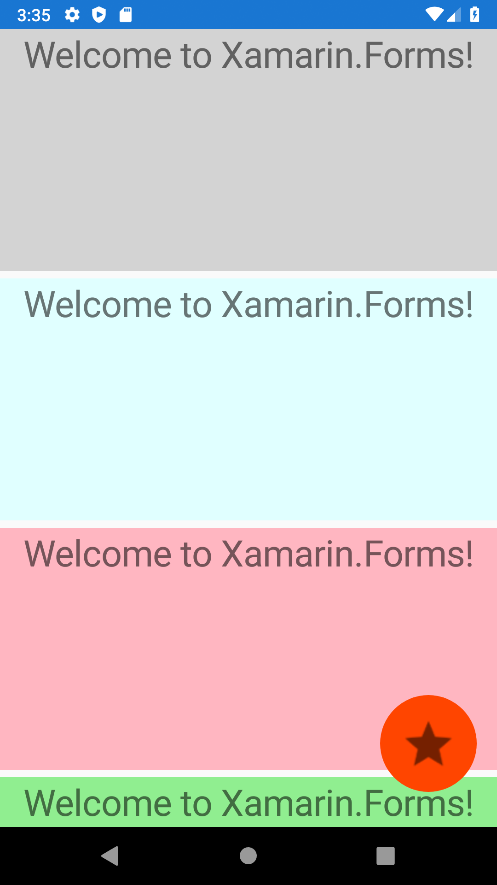
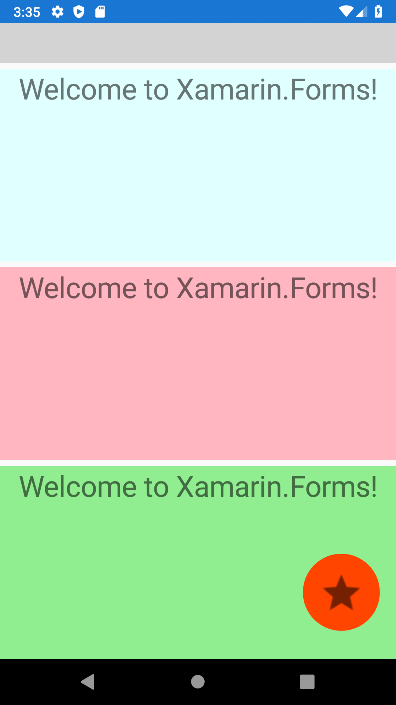

# Xamarin.Forms - How to Create a FloatingActionButton

What is floating action button?  
Well..., it's a button, it's floating and when you press it, it does some action. Simple!

It looks like this (red circle button at the bottom right):



We won't need any other special NuGet package reference for this example, however it would be fine to have some icon or image that we can use for that button. So let's start with this.

## Get an Image for Button

There are multiple ways how to find images for your buttons.  
Here is one way how you can do that.

1. Google for `Android Asset Studio` and choose `Generic icon generator`. (Here is the [link](https://romannurik.github.io/AndroidAssetStudio/icons-generic.html#source.type=clipart&source.clipart=star&source.space.trim=1&source.space.pad=0&size=32&padding=8&color=rgba(0%2C%200%2C%200%2C%200.54)&name=ic_star))
2. Download, unzip file and copy all `drawable-*` directories to your `Android\Resources` project directory (e.g. `FloatingActionButton\FloatingActionButton.Android\Resources`).  There are multiple directoriers ending with `-hdpi`, `-mdpi`, '-xhdpi', etc. because those are for different resolutions of mobile devices. Note, that if you have only one image, put it to `drawable` folder (without any suffix).
3. Open `Solution Explorer` and toggle `Show All Files`, so that you can see those newly added directories under your `Android\Resources` directory.
4. Select all of them and right-click to press `Include In Project`.

Now, when we have referenced an image, let's use it in our new floating action button.

## Create FloatingActionButton

Open your XAML content page and change it like this:

```xml
<?xml version="1.0" encoding="utf-8" ?>
<ContentPage
    x:Class="FloatingActionButton.MainPage"
    xmlns="http://xamarin.com/schemas/2014/forms"
    xmlns:x="http://schemas.microsoft.com/winfx/2009/xaml"
    xmlns:d="http://xamarin.com/schemas/2014/forms/design"
    xmlns:mc="http://schemas.openxmlformats.org/markup-compatibility/2006"
    mc:Ignorable="d">
    <AbsoluteLayout>
        <ScrollView AbsoluteLayout.LayoutBounds="0,0,1,1" AbsoluteLayout.LayoutFlags="SizeProportional">
            <StackLayout>
                <Label
                    BackgroundColor="LightGray"
                    FontSize="30"
                    HeightRequest="200"
                    HorizontalOptions="Fill"
                    HorizontalTextAlignment="Center"
                    Text="Welcome to Xamarin.Forms!"
                    VerticalOptions="Start" />
                <Label
                    BackgroundColor="LightCyan"
                    FontSize="30"
                    HeightRequest="200"
                    HorizontalOptions="Fill"
                    HorizontalTextAlignment="Center"
                    Text="Welcome to Xamarin.Forms!"
                    VerticalOptions="Start" />
                <Label
                    BackgroundColor="LightPink"
                    FontSize="30"
                    HeightRequest="200"
                    HorizontalOptions="Fill"
                    HorizontalTextAlignment="Center"
                    Text="Welcome to Xamarin.Forms!"
                    VerticalOptions="Start" />
                <Label
                    BackgroundColor="LightGreen"
                    FontSize="30"
                    HeightRequest="200"
                    HorizontalOptions="Fill"
                    HorizontalTextAlignment="Center"
                    Text="Welcome to Xamarin.Forms!"
                    VerticalOptions="Start" />
            </StackLayout>
        </ScrollView>
        <ImageButton
            AbsoluteLayout.LayoutBounds="0.95,0.95,80,80"
            AbsoluteLayout.LayoutFlags="PositionProportional"
            BackgroundColor="OrangeRed"
            CornerRadius="40"
            HeightRequest="80"
            Source="ic_star.png"
            WidthRequest="80" />
    </AbsoluteLayout>
</ContentPage>
```

Let's explain what is what. 

- Reason for usage of `AbsoluteLayout` is that we want our button to float above a `ScrollView`.
- `ScrollView` is used there so that we can scroll multiple controls (Labels in this example). If you don't need to scroll content, this is optional.
- Multiple big `Label`s are there just to fill space so that we can scroll it, background is changed so that you can see how it looks when it's scrolled:



In order to add action to this button, add Command property and bind it to command from ViewModel. [Here](https://dev.to/petermilovcik/xamarin-forms-navigation-to-page-not-defined-in-appshell-xaml-2503) you can find an example how to do that.
