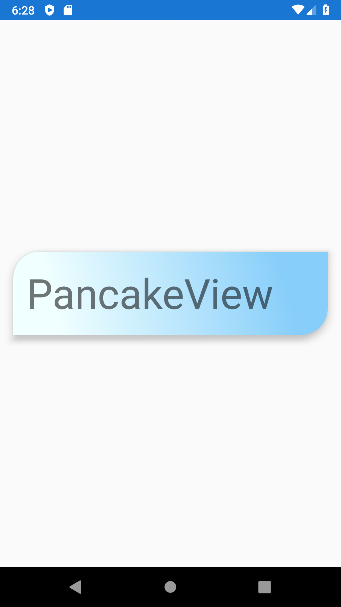

# Xamarin.Forms - How to Use PancakeView

`An extended ContentView for Xamarin.Forms with rounded corners, borders, shadows and more!`


Source: https://github.com/sthewissen/Xamarin.Forms.PancakeView

Let's try to add it to our Xamarin.Forms application. Example is created using `Blank Template`, but it can be used in app created with any other template as well.

## Add NuGet Package

In order to use this `PancakeView` you need to add reference to NuGet package called 
[Xamarin.Forms.PancakeView](https://www.nuget.org/packages/Xamarin.Forms.PancakeView).

There are multiple ways on how to install some NuGet package, here is one way how to do it:

1. Right click on the solution name in `Solution Explorer` to open context menu and then press `Manage NuGet Packages for Solution...`
2. Select `Browse` tab and search for `Xamarin.Forms.PancakeView` by Steven Thewissen.
3. Select all projects (right side) and press `Install`.
4. If installation is successful, you should see something like `Successfully installed 'Xamarin.Forms.PancakeView'` in `Output` window.

## Add Namespace in XAML

Once you reference `PancakeView` reference in your projects, you have to add a namespace in your XAML file.
Open XAML where you would like to use it and add 

```xml
xmlns:yummy="clr-namespace:Xamarin.Forms.PancakeView;assembly=Xamarin.Forms.PancakeView"
```

## Use it in XAML

Here is example how it can be used:

```xml
<?xml version="1.0" encoding="utf-8" ?>
<ContentPage
    x:Class="PancakeView.MainPage"
    xmlns="http://xamarin.com/schemas/2014/forms"
    xmlns:x="http://schemas.microsoft.com/winfx/2009/xaml"
    xmlns:d="http://xamarin.com/schemas/2014/forms/design"
    xmlns:mc="http://schemas.openxmlformats.org/markup-compatibility/2006"
    xmlns:yummy="clr-namespace:Xamarin.Forms.PancakeView;assembly=Xamarin.Forms.PancakeView"
    mc:Ignorable="d">
    <StackLayout>
        <yummy:PancakeView
            Margin="16"
            BackgroundGradientAngle="45"
            BackgroundGradientEndColor="Azure"
            BackgroundGradientStartColor="LightSkyBlue"
            CornerRadius="32,0,0,32"
            HasShadow="True"
            HeightRequest="100"
            VerticalOptions="CenterAndExpand">
            <Label
                Margin="16,0"
                FontSize="50"
                Text="PancakeView"
                VerticalOptions="Center" />
        </yummy:PancakeView>
    </StackLayout>
</ContentPage>
```

Result is looks like this:

