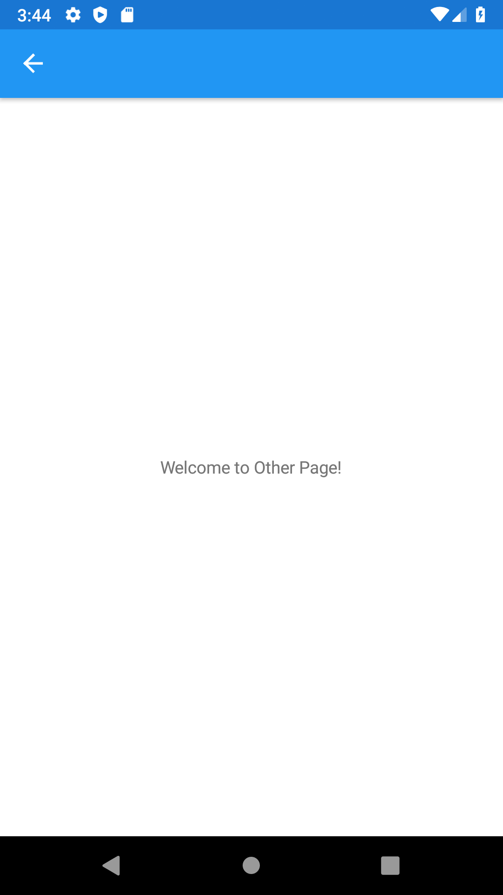

# Reduce Xamarin.Forms Shell Template to Bare Minimum

If you want to start with Xamarin.Forms Shell application, there are two options.
1. Start with Blank template, create Shell manually then adapt the rest of code.
2. Start with Shell template and then remove unnecessary generated code which we might not need to use at all.

Let's take a look on the 2nd option:


The template already creates some additional files like:

In **Models** directory:
* `Item.cs`

In **Services** directory:
* `IDataStore.cs`
* `MockDataStore.cs`

In **ViewModels** directory:
* `AboutViewModel.cs`
* `BaseViewModel.cs`
* `ItemDetailViewModel.cs`
* `ItemsViewModel.cs`

In **Views** directory:
* `AboutPage.xaml`
* `AboutPage.xaml.cs`
* `ItemDetailPage.xaml`
* `ItemDetailPage.xaml.cs`
* `ItemsPage.xaml`
* `ItemsPage.xaml.cs`
* `NewItemPage.xaml`
* `NewItemPage.xaml.cs`

### Delete code

If you want to have a clean and empty Shell application start by deleting all these files except `BaseViewModel.cs` which contains some useful implementation of `INotifyPropertyChanged` interface so that you don't have to implement it by yourself again. Keep the directories, they help to keep code organized in well named namespaces.

If you try to build the solution after deleting those files you would get multiple compilation errors. That's expected, we are not done yet.

Open `BaseViewModel.cs` file and delete:
```csharp
using XamarinNavigation.Models;
using XamarinNavigation.Services;
```
and property
```csharp
public IDataStore<Item> DataStore => DependencyService.Get<IDataStore<Item>>();
```

Open `App.xaml.cs` file and delete:
```csharp
using XamarinNavigation.Services;
using XamarinNavigation.Views;
```
and registration on dependency service:
```csharp
DependencyService.Register<MockDataStore>();
```

If you try to build solution again, you still get compilation error that says something like:
```
Type ItemsPage not found in xmlns clr-namespace: ... AppShell.xaml
```

This is also expected, since we deleted `ItemsPage.xaml`, so let's create new `ContentPage` called (e.g.) `MainView.xaml` and place it in `Views` directory, like this:

### New MainView


#### MainView.xaml
```xaml
<?xml version="1.0" encoding="utf-8" ?>
<ContentPage xmlns="http://xamarin.com/schemas/2014/forms"
             xmlns:x="http://schemas.microsoft.com/winfx/2009/xaml"
             xmlns:d="http://xamarin.com/schemas/2014/forms/design"
             xmlns:mc="http://schemas.openxmlformats.org/markup-compatibility/2006"
             mc:Ignorable="d"
             x:Class="XamarinNavigation.Views.MainView">
    <ContentPage.Content>
        <StackLayout>
            <Label Text="Welcome to Xamarin.Forms!"
                VerticalOptions="CenterAndExpand" 
                HorizontalOptions="CenterAndExpand" />
        </StackLayout>
    </ContentPage.Content>
</ContentPage>
```

#### MainView.xaml.cs
```csharp
using System;
using System.Collections.Generic;
using System.Linq;
using System.Text;
using System.Threading.Tasks;

using Xamarin.Forms;
using Xamarin.Forms.Xaml;

namespace XamarinNavigation.Views
{
    [XamlCompilation(XamlCompilationOptions.Compile)]
    public partial class MainView : ContentPage
    {
        public MainView()
        {
            InitializeComponent();
        }
    }
}
```

### Adapt AppShell.xaml

Now, change the `AppShell.xaml` to have only single page (without any additional flyouts or tabs):

```xaml
<?xml version="1.0" encoding="UTF-8" ?>
<Shell
    x:Class="XamarinNavigation.AppShell"
    xmlns="http://xamarin.com/schemas/2014/forms"
    xmlns:x="http://schemas.microsoft.com/winfx/2009/xaml"
    xmlns:d="http://xamarin.com/schemas/2014/forms/design"
    xmlns:local="clr-namespace:XamarinNavigation.Views"
    xmlns:mc="http://schemas.openxmlformats.org/markup-compatibility/2006"
    Title="XamarinNavigation"
    mc:Ignorable="d">

    <Shell.Resources>
        <ResourceDictionary>
            <Color x:Key="NavigationPrimary">#2196F3</Color>
            <Style x:Key="BaseStyle" TargetType="Element">
                <Setter Property="Shell.BackgroundColor" Value="{StaticResource NavigationPrimary}" />
                <Setter Property="Shell.ForegroundColor" Value="White" />
                <Setter Property="Shell.TitleColor" Value="White" />
                <Setter Property="Shell.DisabledColor" Value="#B4FFFFFF" />
                <Setter Property="Shell.UnselectedColor" Value="#95FFFFFF" />
                <Setter Property="Shell.TabBarBackgroundColor" Value="{StaticResource NavigationPrimary}" />
                <Setter Property="Shell.TabBarForegroundColor" Value="White" />
                <Setter Property="Shell.TabBarUnselectedColor" Value="#95FFFFFF" />
                <Setter Property="Shell.TabBarTitleColor" Value="White" />
            </Style>
            <Style BasedOn="{StaticResource BaseStyle}" TargetType="TabBar" />
        </ResourceDictionary>
    </Shell.Resources>

    <TabBar>
        <Tab Title="Main" Icon="xamarin_logo.png">
            <ShellContent ContentTemplate="{DataTemplate local:MainView}" />
        </Tab>
    </TabBar>

</Shell>
```

Now, build and start your newly created Shell the application:


# Navigation to Page Not Defined in AppShell.xaml

### Add New Page

Let's add new page called `OtherView` (under the Views directory) which will be content page we will navigate from `MainView`.


Change the `Label` text in created `OtherView.xaml` so that it's clear that it's different page when we navigate to it:

```xml
            <Label
                HorizontalOptions="CenterAndExpand"
                Text="Welcome to Other Page!"
                VerticalOptions="CenterAndExpand" />
```

### Register Route to New Page

Open `AppShell.xaml.cs` and change it like this:
```csharp
using Xamarin.Forms;
using XamarinNavigation.Views;

namespace XamarinNavigation
{
    public partial class AppShell : Shell
    {
        public AppShell()
        {
            InitializeComponent();
            RegisterRoutes();
        }

        private void RegisterRoutes()
        {
            Routing.RegisterRoute("other", typeof(OtherView));
        }
    }
}
```

What we added is private method called `RegisterRoutes` in constructor of `AppShell`. It's implementation contains registration of a global route to our new page called `OtherView`.

For more information, see:  
https://docs.microsoft.com/en-us/xamarin/xamarin-forms/app-fundamentals/shell/navigation=

### Add a Button for Navigation

Add a `Button` in `MainView.xaml`. 

```xml
<StackLayout>
    <Label
        HorizontalOptions="CenterAndExpand"
        Text="Welcome to Xamarin.Forms!"
        VerticalOptions="CenterAndExpand" />
    <Button Text="Press me!" />
</StackLayout>
```

When we press this button now, nothing happens. This is expected, because we didn't bind it to any command yet.
Let's do that in next step.

### Add MainViewModel

Create new class called `MainViewModel` in `ViewModels` directory.


```csharp
namespace XamarinNavigation.ViewModels
{
    public class MainViewModel : BaseViewModel
    {
    }
}
```

This new class derives from `BaseViewModel` class, so that we don't have to implement again `INotifyPropertyChanged` interface again.

### Join View and ViewModel

There are multiple ways on how to join `View` and `ViewModel` to work together.
Here is one way how to do that:

Adapt `MainView.xaml`. Add 

```xml
xmlns:vm="clr-namespace:XamarinNavigation.ViewModels"
```

to `<ContentPage>` declaration so that we have reference to `ViewModels` directory (namespace).  
Note, that `vm` is just name for the declared namespace, you can name it as you like (e.g. `viewModels`).

and add `BindingContext` like this:

```xml
    <ContentPage.BindingContext>
        <vm:MainViewModel />
    </ContentPage.BindingContext>
```

the result `MainView` content page looks like this:

```xml
<?xml version="1.0" encoding="utf-8" ?>
<ContentPage
    x:Class="XamarinNavigation.Views.MainView"
    xmlns="http://xamarin.com/schemas/2014/forms"
    xmlns:x="http://schemas.microsoft.com/winfx/2009/xaml"
    xmlns:d="http://xamarin.com/schemas/2014/forms/design"
    xmlns:mc="http://schemas.openxmlformats.org/markup-compatibility/2006"
    xmlns:vm="clr-namespace:XamarinNavigation.ViewModels"
    mc:Ignorable="d">
    <ContentPage.BindingContext>
        <vm:MainViewModel />
    </ContentPage.BindingContext>
    <ContentPage.Content>
        <StackLayout>
            <Label
                HorizontalOptions="CenterAndExpand"
                Text="Welcome to Xamarin.Forms!"
                VerticalOptions="CenterAndExpand" />
            <Button Text="Press me!" />
        </StackLayout>
    </ContentPage.Content>
</ContentPage>
```

When we press the button now, it still doesn't do anything, but now we have `MainViewModel` that we can use for creating a `Command` for binding the button.

### Add Command to Button

Change a button in our `MainView.xaml` like this:

```xml
<Button Command="{Binding PressMeCommand}" Text="Press me!" />
```

We defined `Command` property on button and bind it to property called `PressMeCommand` on our `MainViewModel` view model.

This property doesn't exist yet on view model, so let's create it:

```csharp
using Xamarin.Forms;

namespace XamarinNavigation.ViewModels
{
    public class MainViewModel : BaseViewModel
    {
        public MainViewModel()
        {
            PressMeCommand = new Command(PressMe);
        }

        public Command PressMeCommand { get; }

        private void PressMe(object obj)
        {
        }
    }
}
```

The `Command` implementation comes from defined `using Xamarin.Forms`.
With this implementation the button is always enabled and when button is pressed, `PressMe` method is called. 
Parameter `object obj` is optionally used to bind from `xaml` to pass additional information. 
Currently it will be `null`. 
Convension says that we usually name our command properties with suffix `Command` (e.g. SaveComand, OpenCommand, TapCommand,...)

### Navigate to Other Page

Now, when we have implemented a button with `MVVM (Model-View-ViewModel)` binded to `Command` and registered `OtherView` content page in our `AppShell.xaml.cs`, let's implement actual code used to navigate to this page:

```csharp
    public class MainViewModel : BaseViewModel
    {
        public MainViewModel()
        {
            PressMeCommand = new Command(async obj => await PressMe(obj));
        }

        public Command PressMeCommand { get; }

        private async Task PressMe(object obj)
        {
            await Shell.Current.GoToAsync("other");
        }
    }
```

For more information, see this link:  
https://docs.microsoft.com/en-us/xamarin/xamarin-forms/app-fundamentals/shell/navigation

Let's explain little bit what's going on there:

There are couple of important changes:
1. Implemented `PressMe(object obj)` method:

```csharp
await Shell.Current.GoToAsync("other");
```
`"other"` parameter to `GoToAsync` method represents globally defined route for the `OtherView` page.

2. Changed return value of `PressMe(object obj)` method to `async Task`:

```csharp
private async Task PressMe(object obj)
```
(Very) simply said, if you awaits some `async` method (like we did with `await Shell.Current.GoToAsync("other");`) 
you need to change declaration of containing method to `async` and change return type in case of `void` to `Task`.

What it means is that actual navigation to other page will be performed in different thread.

For more information about asynchronous programming in C# see link:
https://docs.microsoft.com/en-us/dotnet/csharp/async

3. The way how `PressMeCommand` is created is changed and instead of `new Command(PressMe)` there is `new Command(async obj => await PressMe(obj))`. 
Reason for that is that we changed `void` to `Task` and added `async`, so instead of passing delegate parameter we need to pass async lambda.  
Note, that from asynchronous programming point of view, it's still fire and forget.

Now, if we build and start the application here is the navigation in action:

**MainView**:


When you press `PRESS ME!` button located at the bottom of the page, you will navigate to other view:

**OtherView**:



Notice that back buttom is automatically added at the top left corner and it can be used to navigate back to the `MainView`.

